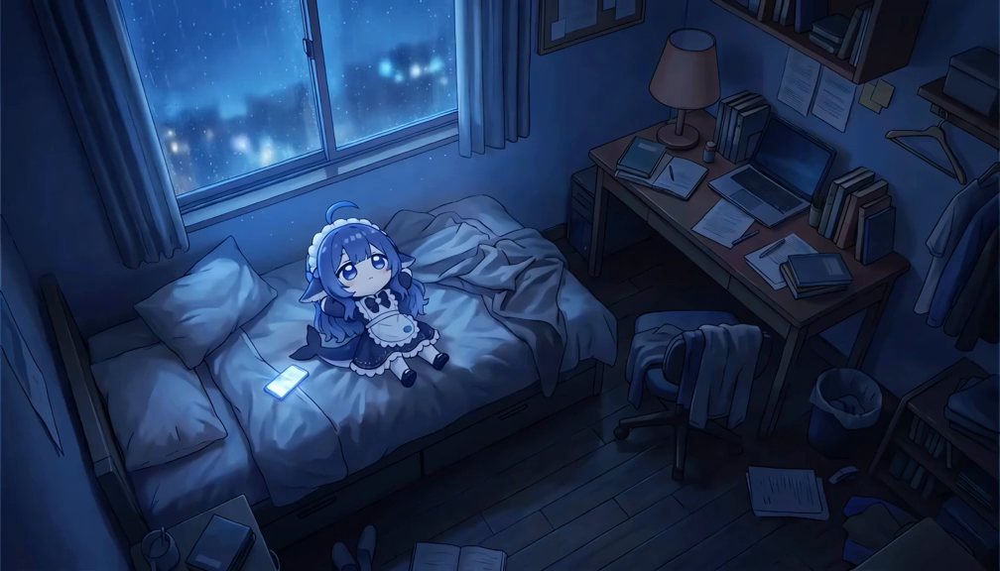
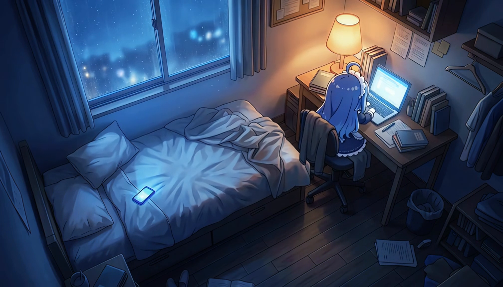
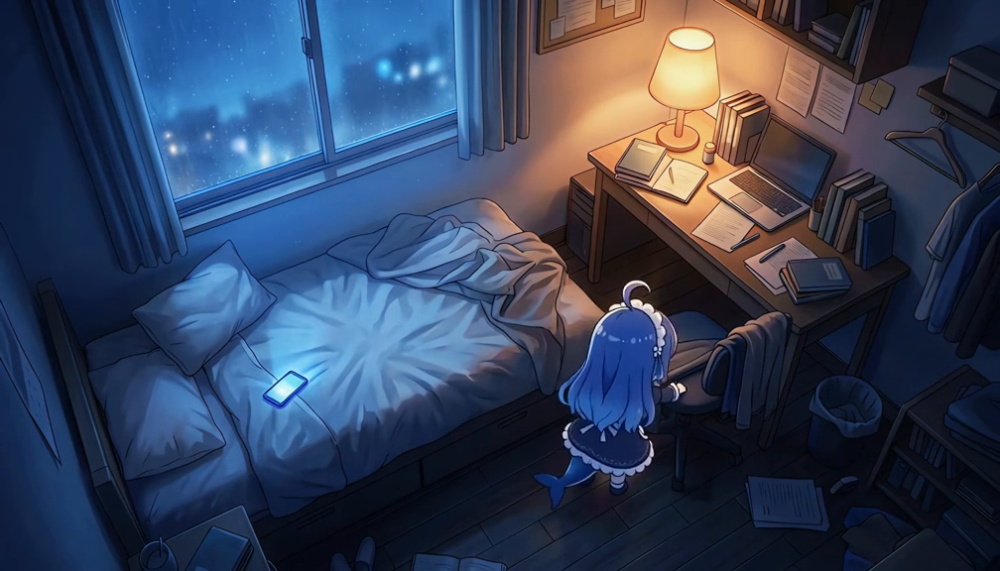

# dsh-whale-girl-wallpaper

把「DeepSeek 鲸鱼娘」动态壁纸视频设为 DSH Web 全屏背景的社区皮肤。

A community DSH Web skin that plays a looping whale-girl wallpaper video behind the
DeepSeek Harness web UI.

## 预览

以下截图来自本仓库内 `assets/wallpaper.mp4` 的真实画面：







## 功能

- 全屏循环播放 `assets/wallpaper.mp4`（静音 + `playsinline` + `object-fit: cover`）。
- `prefers-reduced-motion: reduce` 时停用视频，只显示静态海报 `assets/poster.jpg`。
- 在视频之上叠加可读性遮罩（scrim），避免浅色文字失去对比度。
- host 半侧通过 DSH web server 注册静态资源路由，支持 HTTP Range（视频可拖动/循环）。
- 把 `--dsw-alias-bg-base` 置为透明，让 DSH 的面板下方露出视频；面板自身样式保持不变。

## 兼容范围

| 项 | 值 |
| --- | --- |
| 平台 | DSH Web（`dsh.client.platform = web`） |
| DSH 版本 | `>=0.1.0-rc.6`（仅在 0.1.0-rc.6 上按文档实现，未在其它版本验证） |
| package | `dsh-whale-girl-wallpaper` |
| row ID | `whale-girl-wallpaper` |
| 许可证 | MIT（代码）；见下方「素材与许可」 |

## 安装

市场安装（推荐）：在「设置 → 皮肤市场」中搜索本皮肤并安装。

手动安装（仅 Web profile）：

```sh
dsh plugin --profile web add "github:<your-github-user>/dsh-whale-girl-wallpaper"
```

安装后重启 `dsh web` 并硬刷新页面。

> 官方桌面版请在桌面应用「插件 → 添加插件」中操作，不要执行 `dsh plugin --profile desktop`。

## 仓库结构

```text
package.json           # 包声明：dsh.bundle / dsh.client(platform=web)
cordis.patch.yml       # bundle patch：插入 row id = whale-girl-wallpaper
lib/index.js           # host 半侧：注册 /dsh-whale-girl-wallpaper/assets/* 静态路由
lib/client.js          # 浏览器半侧：预构建的 __ModuleLoader__ bundle，注入全屏视频层
assets/wallpaper.mp4   # 壁纸视频
assets/poster.jpg      # 静态海报（reduced-motion 时使用）
screenshots/           # README 与市场使用的真实界面/画面截图
screenshots.json       # 市场预览图清单（仓库内相对路径）
```

`lib/client.js` 直接以 DSH 客户端模块的构建产物格式（`window.__ModuleLoader__.load`）手写，
不依赖外部导入，因此本仓库没有构建步骤。

## 调整

- 资源路由：改 `cordis.patch.yml` 里的 `config.route`；浏览器半侧需同步改 `lib/client.js` 的 `ROUTE`。
- 画面明暗：改 `lib/client.js` 中 `.dsh-wgw-scrim` 的 `background` 渐变色。
- 视频适配：改 `.dsh-wgw-video` / `video` 的 `object-fit`（`cover` / `contain`）。

## 素材与许可

- `lib/`、`cordis.patch.yml`、`package.json`、`README.md`、`screenshots.json`：MIT（见 [LICENSE](LICENSE)）。
- `assets/wallpaper.mp4`、`assets/poster.jpg`、`screenshots/*`：不在 MIT 覆盖范围内，随仓库原样提供；
  相关角色、形象与商标的权利归各自权利人。如果你是权利人并希望移除其中内容，请开 issue，我们会处理。

## 说明

- 本皮肤是社区项目，与 DeepSeek 官方没有隶属或背书关系。
- 被皮肤市场收录不等于通过安全审核；收录不代表官方或市场对该皮肤的背书。
- 仓库地址：https://github.com/QWEQ-CELL-DEL/dsh-whale-girl-wallpaper。
